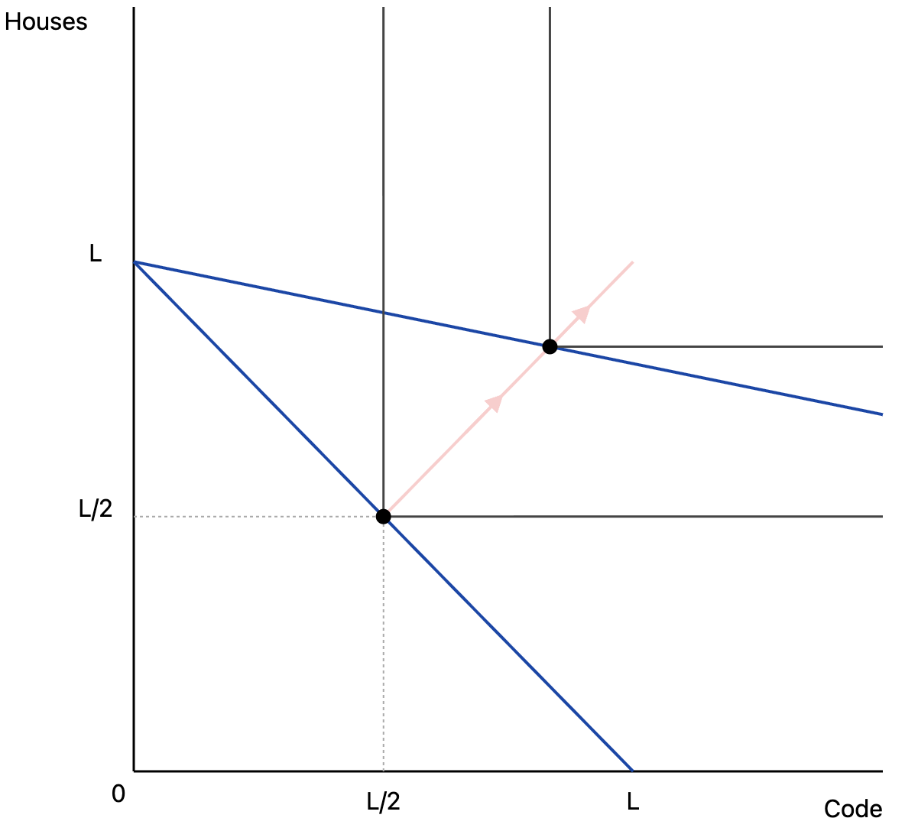

## tl;dr 

* Stagnating aggregate growth from Baumol cost disease is consistent with radical AI-driven transformation of broad sectors of the economy, and correspondingly large increases in standards of living.
* The key question is how much productivity in various sectors will be affected by AI. Whether aggregate growth stagnates because of cost disease is mostly a distraction by comparison.

## Beware arguments from cost disease
Baumol's cost disease might seem to support tempering expectations of how transformative AI will be. The argument is roughly: "ok, we might have substantial productivity growth in some sectors. But for cost disease reasons we should expect labor to be increasingly reallocated to low productivity growth sectors, and so aggregate economic growth will be much more modest. And if aggregate growth is low, we shouldn't expect a meaningfully transformed economy."

This argument has some appeal, but the conclusion ("we shouldn't expect a meaningfully transformed economy") doesn't follow. In brief: even with cost disease, growth stagnates because the output of high-productivity sectors becomes so abundant that its price plummets, and its share of total output value falls too. So even if growth stagnates, this extraordinary abundance could make us much richer in every way that matters.

Below I explain this in more detail, and give other reasons for caution in applying cost disease logic. For the sake of argument and to make the main points clear, I'll take for granted that there will be high AI-driven productivity growth in some sectors.

## What is cost disease?

### The basics
Here's the simplest possible illustration of cost disease.
* The economy produces two goods, houses $H$ and code $C$.
* Labor, $L$, is the only factor of production. $L_H$ and $L_C$ are allocated to housing and code, with $L_H + L_C = L$.
* Productivity growth is $g_H = 0$ in houses and $g_C > 0$ in code. Output is given by $H = L_H$ and $C = e^{t g_C} L_C$, at time $t$ (we'll omit $H$ and $C$'s dependence on $t$ below for conciseness).
* Houses and code are perfect complements, so utility is $U(H, C) = \min(H,C)$.

At time $t=0$, we allocate half of all labor to each sector, and produce $L/2$ units of each good, for utility equal to $L/2$. What will the economy look like in the long run as coding productivity grows? We'll have $L_H \rightarrow L$, $L_C \rightarrow 0$, and output will converge to $L$ units of housing and $L$ units of code. Because the economy approaches but never reaches output of $L$ in both goods, growth decreases to zero. The figure below shows the transition, with two production possibility frontiers in blue (one at time $t = 0$, one at a later time), and the consumption path of the economy as time progresses in red.

This utility function imposes that the ratio of $H$ to $C$ is constant (and indeed the assumption of constant output proportions is behind the original stagnation argument of [Baumol (1967)](https://www.jstor.org/stable/1812111)). Exactly zero substitutability between goods is an extreme case. What happens if we relax this? 

### We can have zero growth even without constant output proportions
Suppose houses and code aren't perfect complements. Depending on what preferences look like, we could still end up in a world where labor is all sucked up by the housing sector (the figure below), or where it all goes to the coding sector, or somewhere in between. That we end up in the first case can't be taken for granted, but to steelman the cost disease argument, let's consider it.[^1] Will aggregate growth to decline to zero, as all labor goes to the sector with zero productivity growth? 

[^1]: This will occur with CES preferences if the elasticity of substitution is under 1, per [Ngai and Pissarides (2007)](https://www.aeaweb.org/articles?id=10.1257/aer.97.1.429). They give a much more complete treatment of this topic, in a more general setting with both capital and labor. 

The answer is yes. Aggregate growth is $g = s_C g_C + s_H g_H$, where $s_C$ and $s_H$ are the expenditure shares of code and housing.[^2] Because $g_H = 0$ by assumption, this reduces to $s_C g_C$. Under perfect competition the share of labor in the coding sector equals the expenditure share of code. So the percent of expenditure going to code, $s_C$, converges to zero, and aggregate growth $g$ goes to zero too.

[^2]: This is measuring real GDP using the Divisia index. If instead we evaluated output at fixed prices, aggregate growth need not converge to zero, because the aggregate value of code produced can increase without bound.

## What does zero growth mean?
The zero growth result may seem counterintuitive. Code output is exploding. Why is it contributing nothing to aggregate growth in the limit? The answer is that its price is collapsing even faster, so that the share of total spending on code is going to zero. And because it's becoming a negligible part of the economy, in terms of fraction of spending, coding growth is increasingly downweighted in calculating aggregate growth.

Note what this does _not_ imply. We're not saying that people aren't any better off. The welfare gains from productivity in coding could be equivalent to a huge increase in income in the pre-growth explosion, $t = 0$ world. That is, **this zero-growth result is consistent us being massively richer as a society, and the economy being totally transformed.**[^3] This is similar to [Nordhaus' famous example](https://www.nber.org/system/files/chapters/c6064/c6064.pdf) of technological improvements in lighting—huge welfare gains, which mostly don't show up in GDP. We should be asking how many more industries are going to be like Nordhaus' lighting example, rather than focusing on whether cost disease will push down aggregate growth.

It is dangerous to transfer our ordinary intuitions about what a zero growth world looks like to a post-AI hypothetical. Zero growth in the sense of "more or less the current economy, but on the verge of recession" and in the sense of "incredible abundance in all products of intelligence, so labor is reallocated to other unproductive sectors" are very different things.

[^3]: A natural counter is "even if the instantaneous growth rate falls to zero, its time-integral still tracks welfare, so long-run living standards are accurately reflected in GDP.” That's certainly more reasonable, but it requires homothetic preferences (from classic index-number results, e.g. [here](https://www.cambridge.org/core/books/abs/essays-in-the-theory-and-measurement-of-consumer-behaviour-in-honour-of-sir-richard-stone/economic-theory-of-index-numbers-a-survey/52A45638278E8E4F9B35E3BD120F48E5)). And that’s before the further gap between GDP and welfare induced by mismeasured quality or new goods.

## Substitutability is not fixed. It's affected by innovation!

Another qualification to the cost disease argument makes it less powerful still. Cost disease hinges on how much consumers substitute across products. If the high productivity sector can produce goods which are increasingly good substitutes for the low productivity sector, then welfare can increase even more, and we may not even be in the world where all labor goes to the unproductive sector and aggregate growth stagnates.

With large productivity gains in one sector but not another, there will be large incentives to figure out how to transfer those gains across sectors. Production functions aren't fixed! They change in response to incentives and innovation, and the incentives to create better substitutes for the output of the low productivity sector will be large.

It's a stretch to think that code can literally substitute for houses. But more sectors may succumb to substitutability than one might expect, as Tyler Cowen [reminds us](https://marginalrevolution.com/marginalrevolution/2023/09/do-not-underrate-the-elasticity-of-supply.html).

There's some irony that Baumol's canonical illustration of cost disease involved a string quartet as the unproductive sector [(Baumol, 1965)](https://www.jstor.org/stable/1816292). Listening to a string quartet perform live is something for which we have developed [pretty good substitutes](https://www.youtube.com/watch?v=otdayisyIiM) for over the past 150 years. As Baumol says in a later paper [(Baumol, 1967)](https://www.jstor.org/stable/1812111)

> It is a matter of degree rather than an absolute dichotomy...Certainly the mass media have created what may be considered a new set of products that are close substitutes for live performance and by which productivity was increased spectacularly 

Granted if there is "authenticity" demand which can only be satisfied by actual humans, then technology can't generate perfect substitutes by definition. How widespread such demand will be will shape our future economy.

## Fixating on cost disease obscures more than it illuminates
There is more that could be said here—e.g. cost disease in intermediate vs final goods, the role of bottlenecks in the production functions, distributional consequences, capital substituting for labor in production. And a declining aggregate growth rate may have implications for fiscal space. But the arguments above should suffice to make the point that stagnationist arguments from cost disease are limited in what they allow us to conclude, and they don't rule out transformative changes. We should instead focus attention on the more important issues—what sectors will be affected by AI, how important are they to peoples' lives, and much do we expect them to change.

