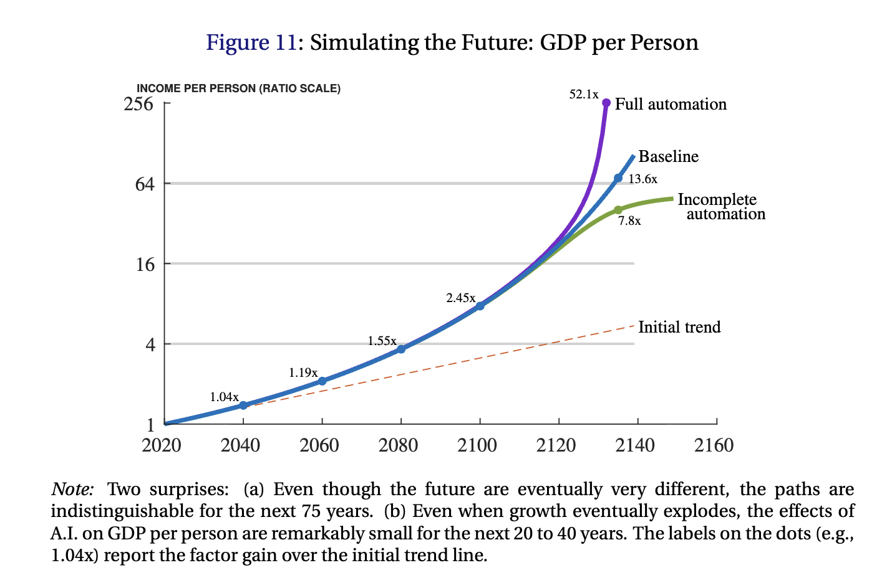

#### March 11, 2026

AI researchers and CEOs expect AI's impact on economic growth in the coming decades, or even years, to be large. Economists meanwhile write papers suggesting that output will be 4% higher by 2040 and a growth explosion might be detectable some time after 2100.

  

This divergence in views is largely because economists view "weak links" or production bottlenecks as serious constraints on growth. The paper from which the figures above were taken, "Past Automation and Future A.I.: How Weak Links Tame the Growth Explosion" is a recent exposition of this view, written by two of the leading growth economists in the world.

The paper is a good illustration of why these two camps seem to talk past each other. There is nothing particularly "AI" about the model, in the sense that its basic building blocks would have been familiar to a growth economist 10 years ago. As an exercise in quantifying how much past growth is due to automation, this is very reasonable, and the paper will surely become a standard reference on the topic. But it seems unlikely to make AI optimists reconsider their growth projections.

How *should* we update this kind of model given the speed of AI progress over the last couple years? Some possibilities:

1. **Directed innovation.** In this model innovation applies generically across all tasks: there is a single idea stock $Q_t$ at time $t$, which raises capital and labor productivities on task $i$ according to $\psi_{kit} = Q_t^{\theta_k} f(i)$, $\psi_{\ell it} = Q_t^{\theta_\ell}$ . In practice we'd expect intense economic incentives to direct innovation *specifically at improving productivity on bottleneck tasks*.

2. **AI recursive self-improvement.** The ideas production feedback loop is modeled as ideas → task productivity → output → research spending → ideas, or $Q_t \to (\psi_{kit},\psi_{\ell it})_{i\in[0,1]}
   \to Y_t
   \to R_t
   \to \dot Q_t$
in the paper's notation, where ideas and research are an undifferentiated aggregate. This can't capture the notion of recursive self-improvement for AI specifically, since there is no distinction between AI ideas and other ideas. How might we model recursive self-improvement for AI? What if we had multiple state variables corresponding to different kinds of ideas, which differentially affected outputs?

3. **What is "structural" anyway?** The authors calibrate the model on data over the last 40+ years. This helps us understand what to expect from extrapolating out from that period as a baseline. But it doesn't capture the idea that we have received important new information over the last 3 - 5 years that should cause us to fundamentally update our views, and some of the deep, structural parameters in the model may not really be invariant to AI progress.

   - For example: Do we really think that the process governing idea growth in $\dot Q_t = \bar q\, R_t^{\lambda} Q_t^{\phi}$ is going to be invariant to AI? AI plausibly makes it easier for scientists to retrieve, synthesize, and recombine prior work (higher $\phi$). And it probably allows them to better direct their research efforts, and explore the hypothesis space more efficiently (higher $\lambda$). It's still early, but anecdotes are accumulating.

4. **Digital workers.** For software engineering AI appears to becoming roughly akin to a digital worker. Suppose we enlarged the model to include digital labor $D_{it}$, so that task $i$ production is $Y_{it} = \psi_{kit} K_{it} + \psi_{\ell it} L_{it} + \psi_{dit} D_{it}$. The aggregate stock of digital labor accumulates according to its own law $\dot D_t = I_t^{AI} - \delta_D D_t$ , for AI-specific investment $I_t^{AI}$. This could directly mitigate the main drag on growth, namely slow-growing human labor. 

5. **Within-task complementarities.** Capital and labor are perfect substitutes at the task level. This may be unfavorable to fast growth if, in practice, capital improvements also raise the productivity of labor on bottleneck tasks. What if bottleneck tasks were jointly produced by capital and labor in equilibrium? For at least some tasks, that may better reflect how people actually use AI: less as pure replacement, and more as a form of joint production.

It's vastly easier to suggest extensions than to actually build models incorporating them. "It takes a model to beat a model", and all that. But it seems *some* updates of the basic growth modeling framework might be warranted, given the progress of AI capabilities, and they may go some way towards bridging the economist/AI optimist gap.

